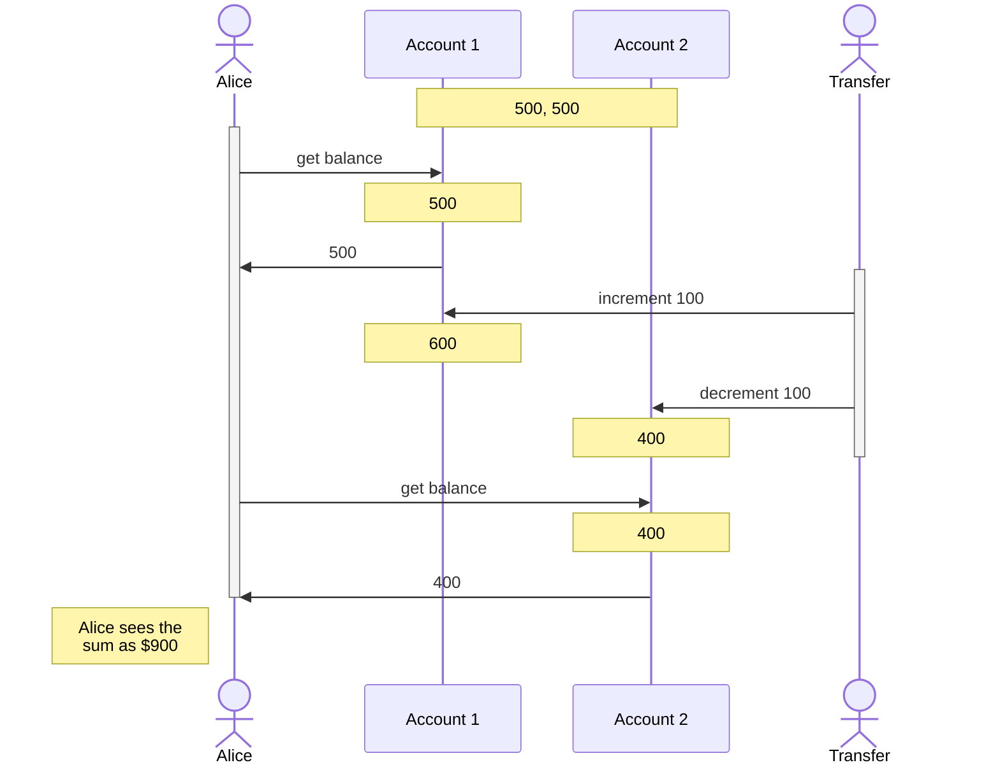

# Designing Data Intensive Applications - Transactions
> Created: 2023-02-13 20:23

A **transaction** is a way for an application to group several reads and writes together into a logical unit. Conceptually, all the reads and writes in a transaction are executed as one operation: either the entire transaction succeeds (commit) or it fails (abort, rollback). If it fails, the application can safely retry. With transactions, error handling becomes much simpler for an application, because it doesn’t need to worry about partial failure—i.e., the case where some operations succeed and some fail (for whatever reason).

## The Concept of a Transaction

NoSQL databases in general abandon the concept of transactions entirely, or redefine it to mean something much weaker than conventionally accepted, for "scalability" reasons.

While transactions do affect scalability and performance, having transactions does not mean that the database is necessarily slow.

### ACID

**ACID:** Atomicity, Consistency, Isolation, Durability. In practice, DB implementations differ in what they mean by "ACID-compliant", and the term is more marketing-oriented than meaning a strict set of engineering guarantees.

> 💡 **BASE:** Basically Available, Soft state, Eventual consistency. Marketing term to oppose ACID, used in NoSQL databases primarily. Terrible and can be used to mean almost anything.

#### Atomicity

Cannot be broken down into further pieces. Generally in multi-threaded applications, atomic operations are ones where one thread cannot see the atomic operation of the other thread in an intermediate state. It sees the state before and after the operation runs. In the context of databases, this is covered by *isolation*.

Atomicity for DBs means that if a client wants to make several writes, but a fault occurs after some writes were processed, then all those writes which have already run are discarded or *rolled back* if the writes were grouped together in a transaction.

In other words, all writes get "locked" in the DB when the transaction *commits*. If the transaction is *aborted*, then the whole thing is rolled back. Atomicity simplifies rerunning the transaction upon encountering failures. *Abortability* might have been a better term.

#### Consistency

In the context of ACID, *consistency* means that the database remains in a "good state" whenever it is observed.

Some forms of consistency can be provided by the DB — for instance, foreign key consistency which ensures that DB rows with compulsory foreign keys have valid mappings to the foreign tables. Other forms of consistency have to be guaranteed by the application only — for example, in an accounting DB, ensuring that the debits and credits add up.

The conditions that need to be true for consistency are called *invariants*. Consistency is generally an application-specific problem, and it is only included here because "ACID" looks cooler than "AID". This is not a joke.

#### Isolation

*Isolation* in the ACID sense means that concurrently executing transactions are isolated from each other: they cannot step on each others' toes. The classic formalization is *serializability*: even if the transactions actually run concurrently, the net effect should be identical to if they ran serially, i.e. one after the other.

True serializability has a strong performance hit, and most DBs do not actually run in this mode (and some do not support it at all). In practice we use weaker isolation levels most of the time.

#### Durability

*Durability* is the promise that once a transaction commits successfully, any data it has written will not be forgotten, even on hardware faults or system crashes.

In single-node DBs, durability usually means writing to nonvolatile storage (with checksums / RAID replication). In a replicated DB, it may mean that data has been successfully copied over to some number of nodes, and the DB will wait until that many writes are completed before reporting a successful commit.

**Perfect durability does not exist.** If something wipes out all disks and backups at the same time, data is gone. But also, nothing is perfect:
+ On writing to disk, if the machine dies, your data is unavailable until the machine can be restored or the disk moved to another machine.
+ A correlated fault (software bug, power outage) can wipe out all replicas at the same time.
+ In async-replicated systems, writes can be lost on leader failure.
+ SSDs have data loss on power failure, lack of power for longer time, block-based failures.
+ Disks can get corrupted or fail completely.

Various risk reduction techniques need to be used together.

### Single-Object and Multi-Object Operations

**Multi-object transactions** are often needed if several pieces of data need to be kept in sync. For example, you might use a separately maintained unread counter for number of unread emails, which is stored and updated for fast retrieval (to avoid crawling the entire `emails` table and count unread emails each time). Now this is something that needs to be updated in sync every time an email is read.

#### Single-Object writes

Storage engines almost universally provide atomicity and isolation at the level of a single object update (say, one row or one document) on one node. This is to avoid issues where data is partially written, or old and new data are spliced together, or reads see partially written/updated values. Somewhat more complex operations like increments, or compare-and-set, might be available in the context of single-object updates as atomic operations.

#### Why multi-object transactions

+ In relational DBs, a row in one table can have a foreign key to another table, in which case these references need to remain valid by updating entries in both tables at the same time.
+ Document DBs encourage denormalization, which means you might need to update several documents together.
+ In DBs with secondary indices, those indices also need to be updated transactionally along with the data, else data can appear in one index but not in another.

#### Handling errors and aborts

Datastores with leaderless replication usually do not follow full ACID guarantees — it runs on a "best effort" basis, the DB will do as much as it can, and if it runs into an error, it won't undo what has already been done. It becomes the application's responsibility to recover from errors.

Retrying aborted transactions can be a simple and effective error handling technique, but isn't perfect:
+ If the transaction actually succeeded, but the acknowledgement was dropped due to a network failure, we might write twice.
+ If the error is due to overload, retrying can make it worse. In this case we should exponentially backoff, or handle overload-related errors differently if possible.
+ It is only worth retrying after transient errors — retries after permanent errors (e.g. constraint violation) is pointless.
+ If the transaction has side effects outside the DB, then aborting the transaction might still keep the side effect, which will be re-done on a retry.

## Weak Isolation Levels

Concurrency issues (race conditions) only come into play when two transactions try to modify the same piece of data, or one transaction tries to read a piece of data that's being modified by another.

In theory, isolation should make your life easier by letting you pretend that no concurrency is happening: **serializable isolation** means that the database guarantees that transactions have the same effect as if they ran serially (i.e., one at a time, without any concurrency). However, serializable isolation has a performance cost, and many databases don’t want to pay that price. It’s therefore common for systems to use weaker levels of isolation, which protect against *some* concurrency issues, but not all. Those levels of isolation are much harder to understand, and they can lead to subtle bugs, but they are nevertheless used in practice.

### Read Committed

The most basic isolation level. Two guarantees:
1. When reading from the database, you will only see data which has been committed. No _dirty reads_. This prevents transactions from seeing partially updated data, and also prevents issues where a transaction got rolled back and undid writes that other reads already saw.
2. When writing to the database, you will only overwrite data which has been committed. No _dirty writes_.

> Read-committed is the most popular isolation level, used in most DBs (including PostgreSQL).

#### Implementation

**Dirty writes.** Usually prevented using row-level locks on any transaction that tries to modify data. Transactions that need to modify a row acquire the lock, so that ensures there is only one transaction modifying a specific row at a given time. The lock is held until the transaction commits or aborts.

**Dirty reads.** We don't generally use the same row-level locks that we use for preventing dirty writes, because then a single long-running modifying transaction will block many reads. Therefore instead, for every object that is written, the database remembers both the old committed value and the new value set by the transaction that currently holds the write lock. While the transaction is ongoing, any other transactions that read the object are simply given the old value. Only when the new value is committed do transactions switch over to reading the new value.

### Snapshot Isolation and Repeatable Read



In the above case, Alice has two accounts with $500 each. If she is unlucky to look at both accounts' balances in the same moment as a transaction that transfers $100 from one account to the other, it is possible that she sees $500 in one account and $400 in the other, making her think $100 has vanished into thin air (notice that both account reads done by Alice return _committed_ values). This is called a **nonrepeatable read** or **read skew**. If Alice repeats this read of both accounts, she will see the correct values of $600 and $400.

Read skew is considered acceptable in read committed isolation. However, some situations cannot tolerate this temporary inconsistency -- like backups (which will slowly read a large amount of data, while transactions continue to modify the DB) and analytical queries (which can span a large portion of the DB and can hence get inconsistent data, leading to wrong analytics).

**Snapshot isolation** is the solution, where the idea is that each transaction reads from a _consistent snapshot_ of the DB, i.e. the transaction sees all the data which was committed _at the start of the transaction_. Even if the data was subsequently changed while the transaction was running, the transaction itself sees only the old data from when it started running, without any of the intermediate modifications. When a transaction can see a consistent snapshot of the state of the data in the DB, it is much easier to reason and understand.

> Snapshot isolation is supported by PostgreSQL, MySQL (InnoDB), Oracle SQL Server etc.

#### Implementing Snapshot Isolation

Write locks are used to prevent dirty writes. However, reads do not require any locks.

For reads, the DB retains several committed versions of the object at the same time, because various in-progress transactions might need to see the state of the DB at different points in time. This is called **Multi-Version Concurrency Control (MVCC)** because it maintains several versions of the same object side-by-side.

MVCC is also used for read-committed isolation: read-committed uses a separate snapshot for each query, while snapshot isolation uses the same snapshot for an entire transaction.

Snapshot isolation in PostgreSQL: ![[Pasted image 20230215142844.png]]

Each transaction has an increasing ID, and writes (create/deletes) are tagged with the ID of the transaction. Deleting/modifying data does not actually get rid of the row, it simply updates the `deleted by` field which marks it for deletion. If a transaction reading the data has an ID less than the transaction having written the data (like in this case, where `13` writes data but `12` is reading it), it returns the older version of the data instead of the new. The older version is kept until a GC process periodically runs and removes old copies of the data which are older than any running transaction.

Updates are translated as a create plus a delete: transaction 13 deducts $100 from account 2, changing the balance from $500 to $400. The accounts table now actually contains two rows for account 2: a row with a balance of $500 which was marked as deleted by transaction 13, and a row with a balance of $400 which was created by transaction 13.

#### Visibility Rules

For presenting a consistent view of the DB:
1. At the start of each transaction, make a list of all the in-progress transactions. Any writes by those transactions are ignored.
2. Any writes by aborted transactions are ignored.
3. Any writes made by a later transaction ID are ignored.
4. All other writes are visible.

In other words, an object is visible if:
+ At the time the reader's transaction started, the transaction that created the object was already committed
+ The object is not marked for deletion, or the transaction which requested deletion did not yet commit by the time the reader transaction started.

#### Indexes

One option is for indexes to point to all versions of the object, and use filtering to remove object versions which are not visible to the current transaction. When GC removes old object versions, the index entries are correspondingly removed.

However in practice, there are optimizations necessary.
+ PostgreSQL avoids updating indexes if multiple object versions can fit on the same page.
+ CouchDB, Datomic, LMDB use B-trees with *append-only/copy-on-write* variants.
	+ Pages of the tree are not overwritten, rather new copies are created for modified pages.
	+ Parent pages are updated to point to the new versions of the page.
	+ Background processes needed for compaction/GC.

### Preventing Lost Updates

The lost update problem can occur if an application reads some value from the database, modifies it, and writes back the modified value (a *read-modify-write* cycle). If two transactions do this concurrently, one of the modifications can be lost, because the second write does not include the first modification. (We sometimes say that the later write *clobbers* the earlier write.)

#### Atomic Write Operations

If code can be expressed in terms of these operations, it is generally the best solutions. Basically the DB provides certain atomic update operations, which are concurrency-safe.

```sql
UPDATE counters SET value = value + 1 WHERE key = 'foo';
```

Document DBs (MongoDB) provide atomic operations for local modifications to a part of a JSON object, and Redis provides atomic datastructure updates (like priority queue modifications). Not all writes can be expressed this way, but it is preferable wherever possible.

Usually implemented by taking an exclusive lock on an object when it's being read -- no other transaction can read it until the update applies. Usually ORMs make it easy to do an operation that is considered by the programmer to be atomic, but in reality is not implemented using a DB atomic operation -- can be a source of subtle bugs.

#### Explicit Locking

```sql
BEGIN TRANSACTION;

SELECT * FROM figures  
WHERE name = 'robot' AND game_id = 222 
FOR UPDATE;

-- Check whether move is valid, then update the position
-- of the piece that was returned by the previous SELECT. 
UPDATE figures SET position = 'c4' WHERE id = 1234;

COMMIT;
```
> The `FOR UPDATE` clause indicates that the database should take a lock on all rows returned by this query.

The application explicitly locks objects which are going to be updated. The problem with this approach is that the programmer might _forget_ to update the application logic to add this lock and introduce a race condition.

#### Automatically detecting lost updates

Execute the transactions in parallel, and if the transaction manager detects a lost update, abort the transaction and retry the read-modify-write cycle.

The advantage is that DBs can perform this in conjuction with the snapshot isolation implementation -- PostgreSQL's repeatable read, Oracle's serializable, and SQL Server's snapshot isolation levels automatically detect lost updates. 

This does not require any app-specific code, and is therefore less error-prone.

#### Compare-and-set

The purpose of this operation is to avoid lost updates by allowing an update to happen only if the value has not changed since you last read it. If the current value does not match what you previously read, the update has no effect, and the read-modify-write cycle must be retried.

```sql
-- This may or may not be safe, depending on the database implementation

UPDATE wiki_pages
SET content = 'new content'
WHERE id = 1234 
AND content = 'old content';
```

However, if the database allows the WHERE clause to read from an old snapshot, this statement may not prevent lost updates, because the condition may be true even though another concurrent write is occurring. Check whether your database’s compare-and-set operation is safe before relying on it.

#### Conflict resolution and replication

All the above get more complex in replicated DBs, as there are copies of the data on multiple nodes which require concurrent updates. 

Locks and compare-and-set operations assume a single copy of the data. However, in DBs with multi-leader or leaderless replication, these techniques do not apply.

A common approach in such replicated databases is to allow concurrent writes to create several conflicting versions of a value (also known as siblings), and to use application code or special data structures to resolve and merge these versions after the fact.

Atomic operations which are commutative (adding items to a set, incrementing a counter etc.) work well over replication -- Riak can prevent lost updates across replicas using these kinds of operations, as it doesn't matter which replica propagation added the new data first. The updates are automatically merged together to lose no information.

LWW (last write wins) conflict resolution on the other hand often loses data -- but is unfortunately the default in most DBs.

### Write Skew and Phantoms

![[Pasted image 20230216164211.png]]

**Write skew** is a generalization of the lost update problem -- it can occur if two transactions read the same objects, then update some of them (different transactions may update different objects). In the special case where different transactions update the same object, you get a dirty write or lost update anomaly.

In the above example, Alice checks how many doctors are on call at the same time as Bob, both see there are 2 doctors on call. So both of them request leave, and set their own rows to `false`. As there are two objects being updated here, there is no dirty write or lost update -- both updates are preserved, but in the context of the application, this is a bug. If the two transactions had run one after the other, then the second doctor would have been prevented from going off call. This only happened because the transactions ran concurrently.

The options for preventing this are more restricted:
+ Atomic single object ops cannot be used -- there are multiple objects.
+ Automatic detection of lost updates (PostgreSQL repeatable read, MySQL-InnoDB repeatable read, Oracle's serializable, SQL Server's snapshot isolation) cannot automatically detect write skew.
+ Most DBs do not have built-in support for multi-object constraints.
+ If there is no serializable isolation level, second-best option is to explicitly lock the rows that the transaction depends on:
```sql
BEGIN TRANSACTION;

SELECT * FROM doctors
	WHERE on_call = true
	AND shift_id = 1234 FOR UPDATE; -- The FOR UPDATE locks it

UPDATE doctors
	SET on_call = false
	WHERE name = 'Alice'
	AND shift_id = 1234;

COMMIT;
```

**Examples of write skew:**
+ *Meeting room booking system.* To enforce that there cannot be two bookings for the same meeting room at the same time. When someone makes a booking, you first check for conflicting bookings (bookings for the same room with overlapping time range) and create a meeting if none are found. However, as another concurrent user inserts a separate newly-created row for a conflicting meeting, this is not prevented by snapshot isolation.
+ *Multiplayer games.* Two players may not be able to move the same figure at the same time, however, the two players might move two different figures to the same position on the board (or some other illegal move).
+ *Claiming a username.* Two users may try to create accounts with the same username at the same time. Simple solution here is a uniqueness constraint, which will abort the transaction for the second user.
+ *Preventing double-spend.* If you insert a new tentative "spending" item into a user's account (with negative cash movement) and then sum up all the items to verify that the sum is positive, you could have two spending items inserted concurrently that make the net sum go negative.

#### Phantoms causing write skew

The pattern is similar:
1. A `SELECT` query checks for some precondition to be satisfied by searching for some rows which match the condition.
2. Depending on the result of the first query, the application decides how to continue.
3. Application makes a write (`INSERT`, `UPDATE` or `DELETE`) to the DB and commits the transaction.

The write in Step 3 violates the precondition in the decision of Step 2. In other words, if you retry Step 1 after committing the write, you get a different result. But notice that the result of Step 1 required by the decision in Step 2 might be that *we get zero rows back*.

This effect, where a write in one transaction changes the result of a search query in another transaction, is called a **phantom**. Snapshot isolation avoids phantoms in read-only queries, but in read-write transactions like the examples we discussed, phantoms can lead to particularly tricky cases of write skew.

#### Materializing conflicts

The problem with write skew is that sometimes the precondition that we have is that there are _zero rows_ returned for the `SELECT` query — which means that there is nothing to lock onto if we want to lock the transaction on the rows which are updated by the write in Step 3 (consider the meeting room example where we perform a booking if we find _no preexisting bookings_).

Hence we can **materialize a conflict** by inserting rows for all possible combinations of rooms and time periods ahead of time, with a placeholder "empty room" type. These rows are returned _and locked_ before being modified with the actual booking details, which prevents a concurrent transaction from updating it at the same time. This process takes a phantom and turns it into a lock conflict on a concrete set of rows that exist in the DB.

However, this can be hard and error-prone to do correctly, and it's ugly to let a concurrency control mechanism leak into the app data model. Hence we do this as a last resort, and prefer _serializable isolation levels_ instead in most cases.

## Serializability

**Serializable isolation** is usually regarded as the strongest isolation level. It guarantees that even though transactions may execute in parallel, the end result is the same as if they had executed one at a time, *serially*, without any concurrency. Thus, the database guarantees that if the transactions behave correctly when run individually, they continue to be correct when run concurrently — in other words, the database prevents *all* possible race conditions.

Serializability today uses one of three techniques:
+ Literally executing transactions in a serial order.
+ Two-phase locking
+ Optimistic concurrency control techniques e.g. serializable snapshot isolation

### Actual Serial Execution

Just remove the concurrency! We completely sidestep the problem of detecting and preventing conflicts between transactions: the resulting isolation is serializable by definition.

Why has this become feasible only recently?
+ RAM became cheap enough to keep the entire active dataset in memory — so transactions can execute much faster and can therefore be run in a single threaded fashion.
+ Database designers realized that OLTP transactions are usually short and only make a small number of reads and writes. Meanwhile, OLAP queries are typically read-only, so they can be run on a consistent snapshot (snapshot isolation level) outside of the serial execution loop.

> VoltDB, H-Store, Redis, Datomic use serial transaction execution.

Transactions running serially need to be structured somewhat differently to have good single-threaded performance.

#### Encapsulating Transactions in Stored Procedures

In the past, it was thought to make an entire application flow into a single transaction which would be committed atomically. However, this means usually waiting for humans to respond in the middle of the transaction execution, which means supporting large amounts of concurrent transactions as humans are very slow to respond. These days transactions are short-lived, often within a single HTTP request, taking the human out of the critical path.

But even those transactions are generally executed client/server style between the application code and the database — app makes a query, makes a decision based on the result, executes another query and so on. A lot of time is spent in network communication between the app and the DB. Throughput gets worse if you remove concurrency in these models.

So instead we encapsulate the entire transaction logic in a **stored procedure** which is given to the DB ahead of time. The application executes the SPC, which runs the entire transaction directly on the DB without waiting for any network or disk I/O.

Pros/cons:
+ Each DB vendor has its own language for stored procedures. They generally suck.
	+ VoltDB uses Java/Groovy, Datomic uses Java/Clojure, Redis uses Lua. A problem that can evidently be overcome.
+ Code running in a DB is harder to manage, debug, keep in version control, deploy, test or integrate with metrics.
+ A DB is much more performance sensitive than application servers. A badly written SPC can cause much more trouble (say, by hogging resources).
+ Executing all transactions on a single thread becomes feasible with SPCs and in-memory data.

#### Partitioning

For applications with a high write throughput, the single-threaded transaction processor can become a serious bottleneck.

If you can find a way of partitioning your dataset so that each transaction only needs to read and write data within a single partition, then each partition can have its own transaction processing thread running independently from the others. This can be assigned to separate CPU cores, allowing linear scaling with CPU.
> VoltDB supports this.

For any transaction that needs multiple partitions, the DB must coordinate the transaction across all the partitions that it touches. The SPC needs to run in lockstep across all partitions to ensure serializability. These are vastly slower than single-partition transactions.
> VoltDB reports 1000 cross-partitions writes per sec, which is orders of magnitude below single-partition throughput and _cannot_ be increased by adding more machines.

#### Summary

+ Every transaction must be small and fast — a single slow transaction stalls everything.
+ Limited to usecases where the active dataset can fit in memory.
	+ If the transaction needs to access data that's not in memory, we could abort the transaction, asynchronously fetch that data into memory (while processing other transactions), then restart the transaction when the data has been loaded. This is called **anti-caching**.
+ Write throughput must be low enough to handle on a single CPU core, else partition needed.
+ Cross partition transactions are possible, but there is a hard limit to the extent they can be used.

### Two-Phase Locking (2PL)

2PL was the only widely used algorithm for serializability in DBs for about 30 years.

> 💡 **Two-phase commit (2PC)** is different and is not to be confused with this.

+ If transaction A has read an object and transaction B wants to write to that object, B must wait until A commits or aborts before it can continue. (This ensures that B can’t change the object unexpectedly behind A’s back.) 
+ If transaction A has written an object and transaction B wants to read that object, B must wait until A commits or aborts before it can continue. (Reading an old version of the object is not acceptable under 2PL.) 

In other words, *writers are exclusive*. Writers block both writers and readers, and are blocked by both other writers and readers. This is different from snapshot isolation, where *readers never block writers, and writers never block readers*. 2PL provides *serializability*, which means it protects all the race conditions discussed earlier.

#### Implementation

> 2PL is used by the "serializable" isolation level in MySQL-InnoDB and SQL Server, and the repeatable read isolation level in DB2.

The blocking is implemented by keeping a lock on each object, which can either be in **shared mode** or **exclusive mode**.
+ If a transaction wants to read an object, it must first acquire the lock in shared mode. Shared mode allows several transactions to hold the lock simultaneously.
+ If a transaction wants to write to an object, it must first acquire the lock in exclusive mode. *No other transaction may hold the lock in either mode at the same time*.
+ If a transaction first reads and then writes an object, it may upgrade its shared lock to an exclusive lock, which works the same way as acquiring an exclusive lock.
+ After the transaction has acquired the lock, it continues to hold the lock until the transaction ends.
	+ This is where two-phase comes from: first phase is when the locks is acquired, and the second phase (at the end of the transaction) is when all the locks are released.

It can happen that Transaction A is stuck waiting for Transaction B to release its lock and vice versa — a **deadlock**. The DB automatically detects these and aborts one of the transactions, which needs to be retried by the application.

#### Performance

Performance of this is pretty bad compared to weak isolation — part of this is the overhead of acquiring/releasing all the locks, and more importantly due to reduced concurrency. By design, if two concurrent transactions try to do anything that may in any way result in a race condition, one has to wait for the other to complete.

Ensure you keep your transactions short — else they may end up waiting for super long and queues will form among your transactions.

For this reason, DBs running 2PL can be unstable in latency, especially on tail latencies if there is contention in the workload. It may take only a single slow transaction, or one that accesses a lot of data and acquires many locks.

Deadlocks also occur much more frequently under 2PL. This can be an additional performance problem.

#### Predicate Locks

Just like in [[#Phantoms causing write skew]], we need a way to implement the locks required by 2PL over the possibility that phantoms are created — i.e. one transaction changing the results of another transaction's search query, with rows that are newly created and didn't exist to be locked before.

To implement this, we use a **predicate lock**. The idea is that the lock belongs to all objects that match some specific search condition:

```sql
SELECT * FROM bookings
	WHERE roomId = 123 AND
	endTime > '2018-01-01 12:00' AND
	startTime < '2018-01-01 13:00';
```

A predicate lock restricts access as follows:
+ If Transaction A wants to read objects matching some condition, it must acquire a shared-mode predicate lock on the conditions of the query.
	+ If another Transaction B currently has an exclusive lock on *any object matching those conditions*, A must wait for B to release the lock.
+ If Transaction A wants to modify any object, it must first check whether *either the old or the new value* matches any existing predicate lock.
	+ If there is a matching predicate lock held by B, then A must wait until B has committed or aborted before it can continue.

The key idea is that the lock applies even to objects that do not yet exist in the DB, but which might be added in the future (phantoms). This is needed for full serializable isolation.

#### Index-range locks

Predicate locks suck in performance, so most 2PL DBs actually implement **index-range locking** (also called next-key locking), which is a simplified approximation of predicate locking.

For index-range locks, the idea is that you can simplify a predicate lock safely by making it match a greater range of objects. Consider in the above example that there is an index on `roomId`. In this case, the shared lock can be attached to the index entry, indicating that a transaction has searched for bookings of room 123.

This locks all bookings of room 123 on the shared lock. Therefore index locks are not as precise as predicate locks are, but they are a good tradeoff because they have much lower overhead.

If there is no suitable index where a range lock can be attached, the DB falls back to a shared lock on the entire table — obviously not good for performance, but a safe fallback position.

### Serializable Snapshot Isolation (SSI)

Full serializability with a small performance penalty (compared against snapshot isolation) can be achieved with a new algorithm called **Serializable Snapshot Isolation (SSI)**. This is fairly new (2008).

> It is used in [PostgreSQL](https://wiki.postgresql.org/wiki/SSI) >v9.1 and FoundationDB (distributed DB).

#### Pessimistic vs Optimistic concurrency control

2PL is *pessimistic* concurrency control — anything might possibly go wrong, so it waits for the situation to be safe again before doing anything. Serial execution is *extreme* pessimism — each transaction "holds an exclusive lock" on the entire DB, but we make the transactions very fast to execute so they only hold the lock for a short time.

SSI is an *optimistic* concurrency control technique. We let the transactions continue, and when the transaction *wants to commit*, the DB checks if anything bad happened, and if so it is aborted and has to be retried. Only transactions that executed serializably are allowed to commit.

Pros/cons:
+ Performs badly if there is high contention (many transactions needing to access the same objects) as this leads to a high proportion of the transactions needing to abort.
+ If there is enough spare capacity, and contention is not too high, optimistic concurrency control performs better than pessimistic ones.
	+ We reduce contention with commutative atomic operations — e.g. concurrent increments can all be applied without conflicting as it doesn't matter which order they are applied in.

SSI is based on snapshot isolation — all reads within a transaction are made from a consistent snapshot of the DB. On top of snapshot isolation, SSI adds an algorithm for detecting serialization conflicts, and determining which transactions to abort.

#### Decisions based on an outdated premise

The general problem with issues like [[#Write Skew and Phantoms|write skew]] is that the transaction reads a *premise*, which the application uses to make a decision, but then that premise gets violated by the time the write to the DB commits. (For example, the premise might be "there are two doctors on call currently".)

When the app makes the query, the DB does not know how the app logic uses the result of the query. DB needs to assume that any change in the premise means the writes in the transaction may be invalid, i.e. there may be a causal dependency between the queries and the writes in the transaction. The DB must detect situations in which a transaction may have acted on an *outdated premise* and abort the transaction.

Two cases:
+ Detecting reads of a stale MVCC object version (i.e. an uncommitted write occurred before the read)
+ Detecting writes that affect prior reads (the write occurs after the read)

##### Detecting stale MVCC reads

![[Pasted image 20230216195459.png]]

In the case above, when Transaction 43 reads Alice's on-call status, it sees `on_call = true`, because Transaction 42 (which sets it to `false`) s uncommitted. #todo 

----

## References
1. DDIA - Chapter 7