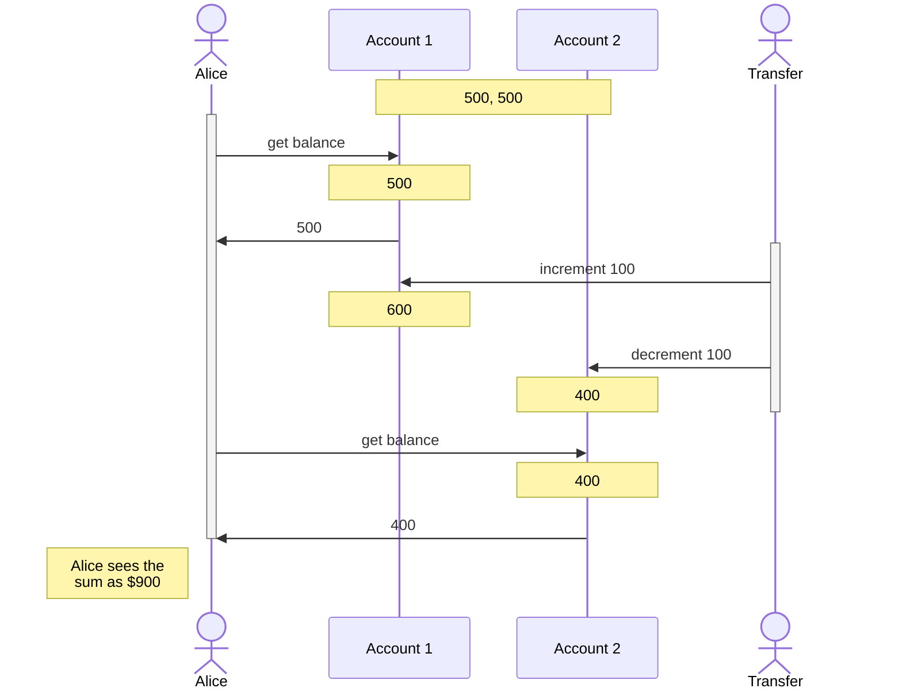

# Transactions
> Created: 2023-02-15 10:31

> (continued from "Weak Isolation Levels", to be merged in to earlier notes)

## Weak Isolation Levels

In theory, isolation should make your life easier by letting you pretend that no concurrency is happening: **serializable isolation** means that the database guarantees that transactions have the same effect as if they ran serially (i.e., one at a time, without any concurrency). However, serializable isolation has a performance cost, and many databases don’t want to pay that price. It’s therefore common for systems to use weaker levels of isolation, which protect against *some* concurrency issues, but not all. Those levels of isolation are much harder to understand, and they can lead to subtle bugs, but they are nevertheless used in practice.

### Read Committed

The most basic isolation level. Two guarantees:
1. When reading from the database, you will only see data which has been committed. No _dirty reads_. This prevents transactions from seeing partially updated data, and also prevents issues where a transaction got rolled back and undid writes that other reads already saw.
2. When writing to the database, you will only overwrite data which has been committed. No _dirty writes_.

> Read-committed is the most popular isolation level, used in most DBs (including PostgreSQL).

#### Implementation

**Dirty writes.** Usually prevented using row-level locks on any transaction that tries to modify data. Transactions that need to modify a row acquire the lock, so that ensures there is only one transaction modifying a specific row at a given time. The lock is held until the transaction commits or aborts.

**Dirty reads.** We don't generally use the same row-level locks that we use for preventing dirty writes, because then a single long-running modifying transaction will block many reads. Therefore instead, for every object that is written, the database remembers both the old committed value and the new value set by the transaction that currently holds the write lock. While the transaction is ongoing, any other transactions that read the object are simply given the old value. Only when the new value is committed do transactions switch over to reading the new value.

### Snapshot Isolation and Repeatable Read



In the above case, Alice has two accounts with $500 each. If she is unlucky to look at both accounts' balances in the same moment as a transaction that transfers $100 from one account to the other, it is possible that she sees $500 in one account and $400 in the other, making her think $100 has vanished into thin air (notice that both account reads done by Alice return _committed_ values). This is called a **nonrepeatable read** or **read skew**. If Alice repeats this read of both accounts, she will see the correct values of $600 and $400.

Read skew is considered acceptable in read committed isolation. However, some situations cannot tolerate this temporary inconsistency -- like backups (which will slowly read a large amount of data, while transactions continue to modify the DB) and analytical queries (which can span a large portion of the DB and can hence get inconsistent data, leading to wrong analytics).

**Snapshot isolation** is the solution, where the idea is that each transaction reads from a _consistent snapshot_ of the DB, i.e. the transaction sees all the data which was committed _at the start of the transaction_. Even if the data was subsequently changed while the transaction was running, the transaction itself sees only the old data from when it started running, without any of the intermediate modifications. When a transaction can see a consistent snapshot of the state of the data in the DB, it is much easier to reason and understand.

> Snapshot isolation is supported by PostgreSQL, MySQL (InnoDB), Oracle SQL Server etc.

#### Implementing Snapshot Isolation

Write locks are used to prevent dirty writes. However, reads do not require any locks.

For reads, the DB retains several committed versions of the object at the same time, because various in-progress transactions might need to see the state of the DB at different points in time. This is called **Multi-Version Concurrency Control (MVCC)** because it maintains several versions of the same object side-by-side.

MVCC is also used for read-committed isolation: read-committed uses a separate snapshot for each query, while snapshot isolation uses the same snapshot for an entire transaction.

Snapshot isolation in PostgreSQL: ![[Pasted image 20230215142844.png]]

Each transaction has an increasing ID, and writes (create/deletes) are tagged with the ID of the transaction. Deleting/modifying data does not actually get rid of the row, it simply updates the `deleted by` field which marks it for deletion. If a transaction reading the data has an ID less than the transaction having written the data (like in this case, where `13` writes data but `12` is reading it), it returns the older version of the data instead of the new. The older version is kept until a GC process periodically runs and removes old copies of the data which are older than any running transaction.

Updates are translated as a create plus a delete: transaction 13 deducts $100 from account 2, changing the balance from $500 to $400. The accounts table now actually contains two rows for account 2: a row with a balance of $500 which was marked as deleted by transaction 13, and a row with a balance of $400 which was created by transaction 13.

#### Visibility Rules

For presenting a consistent view of the DB:
1. At the start of each transaction, make a list of all the in-progress transactions. Any writes by those transactions are ignored.
2. Any writes by aborted transactions are ignored.
3. Any writes made by a later transaction ID are ignored.
4. All other writes are visible.

In other words, an object is visible if:
+ At the time the reader's transaction started, the transaction that created the object was already committed
+ The object is not marked for deletion, or the transaction which requested deletion did not yet commit by the time the reader transaction started.

#### Indexes

One option is for indexes to point to all versions of the object, and use filtering to remove object versions which are not visible to the current transaction. When GC removes old object versions, the index entries are correspondingly removed.

However in practice, there are optimizations necessary.
+ PostgreSQL avoids updating indexes if multiple object versions can fit on the same page.
+ CouchDB, Datomic, LMDB use B-trees with *append-only/copy-on-write* variants.
	+ Pages of the tree are not overwritten, rather new copies are created for modified pages.
	+ Parent pages are updated to point to the new versions of the page.
	+ Background processes needed for compaction/GC.

### Preventing Lost Updates

The lost update problem can occur if an application reads some value from the database, modifies it, and writes back the modified value (a *read-modify-write* cycle). If two transactions do this concurrently, one of the modifications can be lost, because the second write does not include the first modification. (We sometimes say that the later write *clobbers* the earlier write.)

#### Atomic Write Operations

If code can be expressed in terms of these operations, it is generally the best solutions. Basically the DB provides certain atomic update operations, which are concurrency-safe.

```sql
UPDATE counters SET value = value + 1 WHERE key = 'foo';
```

Document DBs (MongoDB) provide atomic operations for local modifications to a part of a JSON object, and Redis provides atomic datastructure updates (like priority queue modifications). Not all writes can be expressed this way, but it is preferable wherever possible.

Usually implemented by taking an exclusive lock on an object when it's being read -- no other transaction can read it until the update applies. Usually ORMs make it easy to do an operation that is considered by the programmer to be atomic, but in reality is not implemented using a DB atomic operation -- can be a source of subtle bugs.

#### Explicit Locking

```sql
BEGIN TRANSACTION;

SELECT * FROM figures  
WHERE name = 'robot' AND game_id = 222 
FOR UPDATE;

-- Check whether move is valid, then update the position
-- of the piece that was returned by the previous SELECT. 
UPDATE figures SET position = 'c4' WHERE id = 1234;

COMMIT;
```
> The `FOR UPDATE` clause indicates that the database should take a lock on all rows returned by this query.

The application explicitly locks objects which are going to be updated. The problem with this approach is that the programmer might _forget_ to update the application logic to add this lock and introduce a race condition.

#### Automatically detecting lost updates

Execute the transactions in parallel, and if the transaction manager detects a lost update, abort the transaction and retry the read-modify-write cycle.

The advantage is that DBs can perform this in conjuction with the snapshot isolation implementation -- PostgreSQL's repeatable read, Oracle's serializable, and SQL Server's snapshot isolation levels automatically detect lost updates. 

This does not require any app-specific code, and is therefore less error-prone.

#### Compare-and-set

The purpose of this operation is to avoid lost updates by allowing an update to happen only if the value has not changed since you last read it. If the current value does not match what you previously read, the update has no effect, and the read-modify-write cycle must be retried.

```sql
-- This may or may not be safe, depending on the database implementation

UPDATE wiki_pages
SET content = 'new content'
WHERE id = 1234 
AND content = 'old content';
```

However, if the database allows the WHERE clause to read from an old snapshot, this statement may not prevent lost updates, because the condition may be true even though another concurrent write is occurring. Check whether your database’s compare-and-set operation is safe before relying on it.

#### Conflict resolution and replication

All the above get more complex in replicated DBs, as there are copies of the data on multiple nodes which require concurrent updates. 

Locks and compare-and-set operations assume a single copy of the data. However, in DBs with multi-leader or leaderless replication, these techniques do not apply.

A common approach in such replicated databases is to allow concurrent writes to create several conflicting versions of a value (also known as siblings), and to use application code or special data structures to resolve and merge these versions after the fact.

Atomic operations which are commutative (adding items to a set, incrementing a counter etc.) work well over replication -- Riak can prevent lost updates across replicas using these kinds of operations, as it doesn't matter which replica propagation added the new data first. The updates are automatically merged together to lose no information.

LWW (last write wins) conflict resolution on the other hand often loses data -- but is unfortunately the default in most DBs.

----

## References
1. DDIA Chapter 7